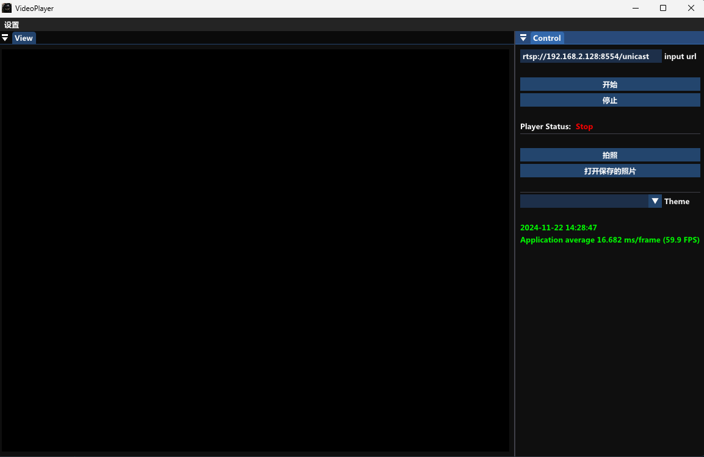

## build for win

Visual Studio 2022

```
mkdir build && cd build
cmake ..
MSBuild.exe VideoPlayer.sln -t:Rebuild -p:Configuration=Release
```

## build for Linux
```
sudo apt install ffmpeg -y
mkdir build && cd build
cmake ..
make -j8
```

App Demo base on imgui.



